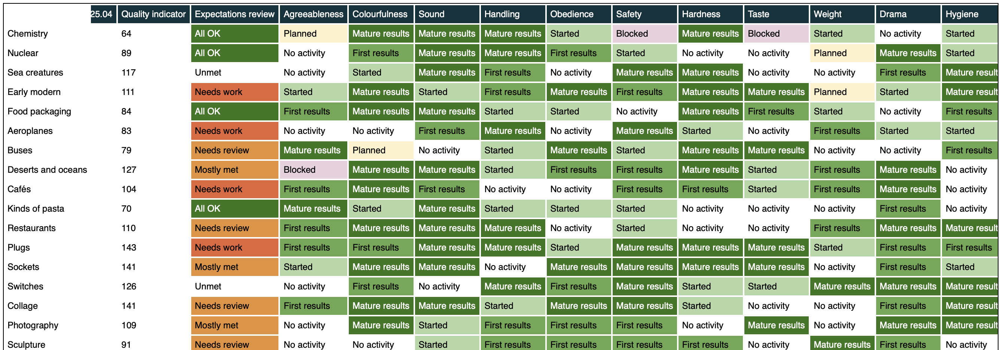

# Dashboard

A Django-based database-driven web application, to track the progress of projects against a set of criteria to measure quality and progress.



This repo contains the source code of the application. [Run the application from source](./dashboard#readme)

This repo also contains the source code of a Kubernetes charm for operating the application as part of a Juju deployment.
To learn about Juju and charms, see https://juju.is/docs.

> [!IMPORTANT]  
> To use the dashboard charm in a real Juju deployment, see [TODO: docs on Charmhub] instead of this repo.
> This repo is the right place to look if you'd like to test the charm, customise it for your own purposes, or contribute to development!


## Deploy the charm on your machine

Work in progress. Aspects to cover:
- Minimal steps to get the application running from scratch
- Set up Juju and craft tools, pack rock, pack charm, deploy charm.
  Before packing the rock, run:
    ```
    cp dashboard_rock_patch/dashboard/settings.py dashboard/dashboard
    ```
- Integrate the PostgreSQL charm
- Configure charm to work without ingress, in debug mode
- Open the dashboard in your browser
- Load sample data


## Simulate a production deployment

Work in progress. Aspects to cover:
- Integrating ingress
- How to disable debug mode and still have the application work
- Probably more...
